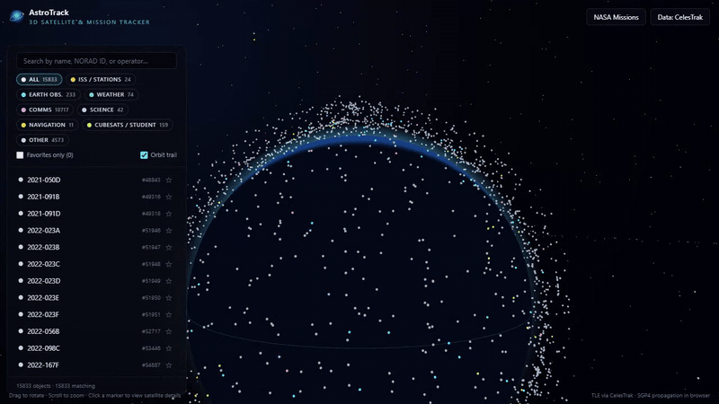
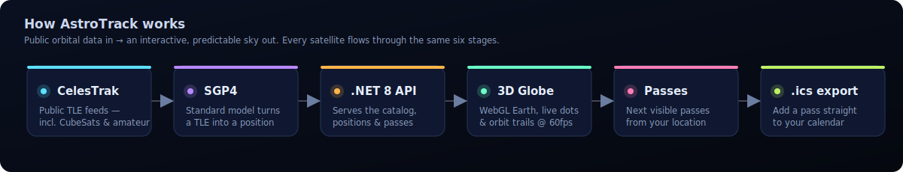
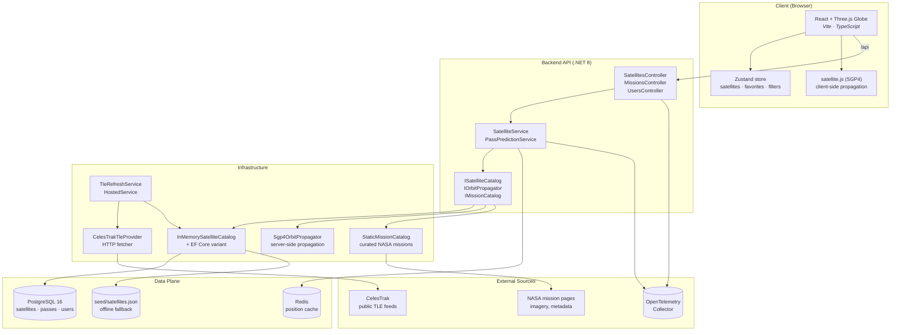

<div align="center">

# AstroTrack

### 3D Satellite & Mission Tracker · Real-Time SGP4 Propagation · NASA Mission Explorer · Pass Prediction Platform

*Visualize every active satellite in low Earth orbit on an interactive 3D globe — with live position, mission metadata, ground tracks, the next five visible passes from any location on Earth, and curated links to NASA mission resources.*



[](LICENSE)
[](#roadmap--build-phases)
[](#tech-stack)
[](#tech-stack)
[](#tech-stack)
[](#tech-stack)
[](#tech-stack)
[](#tech-stack)
[](#repository-layout)

[](#use-cases)
[](#how-astrotrack-makes-space-legible-the-data-surface)
[](#standards--compliance)
[](#standards--compliance)
[](#standards--compliance)
[](#features--capabilities)
[](#features--capabilities)
[](#tech-stack)
[](#repository-layout)
[](#use-cases)
[](CONTRIBUTING.md)

</div>

---

**AstroTrack is a real-time 3D satellite and mission-tracking platform.** It ingests Two-Line Element (TLE) sets from public catalogs, propagates every active object in low Earth orbit through an industry-standard SGP4 model, and renders the resulting positions, orbit trails, and ground tracks on an interactive WebGL globe — so anyone, from a student tracking their university's CubeSat to an educator teaching orbital mechanics to an aerospace engineer, can see *what is in orbit right now*, *where it is*, *which mission it belongs to*, and *when it will be visible from their location*.

**Built for**: students and educators learning orbital mechanics, Earth observation, and mission design · student and university satellite teams who want to watch their own CubeSat (and the missions they admire) on a live map · classrooms and labs that need an always-on, offline-capable teaching surface · space enthusiasts tracking the ISS, Hubble, Starlink, NOAA, and GOES on one screen · amateur-radio operators and hobbyist astronomers planning visible passes.

**Key capabilities**: 3D WebGL globe with rotation, zoom, day/night lighting · multi-category TLE ingestion (Stations, NOAA, GOES, Resource, Starlink, Iridium NEXT, GPS Ops, Galileo, Science, **CubeSats / Education / Amateur**, Active) · SGP4 / SDP4 orbit propagation · live position + velocity computation · orbit-trail rendering across one full revolution · location-based pass prediction with start / peak / end / max-elevation / visibility scoring · `.ics` calendar export · curated NASA mission explorer with imagery and external links · category filters, search, favorites · OpenTelemetry instrumentation · offline-capable mode with embedded fallback TLEs.

---

## See It In Action

<p align="center">
  
</p>

> Real screen capture of the running stack: search the ISS → read its live SGP4 position → get the next visible passes from New York with one-click calendar export → then filter the globe down to **student-built CubeSats**. No edits, no mockups — this is the app on `docker compose up`.

---

## Self-Hosting

AstroTrack is designed to run on your own infrastructure with a single command.

```bash
git clone https://github.com/MeAkash77/AstroTrack-Real-Time-3D-Satellite-Mission-Tracking-Platform.git
cd AstroTrack
docker compose up --build
```

Once the stack is up:

- **Frontend** — http://localhost:8080
- **API / Swagger** — http://localhost:5080/swagger

Full guide: see [docs/self-hosting.md](docs/self-hosting.md) and [docs/configuration.md](docs/configuration.md).

---

<a id="the-problem"></a>

## Why Space Activity Stays Invisible: The Awareness Gap Above Our Heads

There are more than ten thousand active satellites in orbit today — and a growing share of them are built by students: university CubeSats, capstone projects, and amateur-radio missions. The International Space Station crosses the sky overhead roughly every ninety minutes. NASA, NOAA, ESA, and dozens of operators are continuously observing Earth, relaying communications, and conducting science — and almost no one on the ground can point to any of it.

> The sky isn't empty. It's the busiest piece of infrastructure humanity operates — and most students have no map of it. Orbits get taught from static textbook diagrams; a student-satellite team can't easily show their own CubeSat moving in real time; anyone curious juggles three websites and a TLE text file just to figure out when the ISS will pass over campus.

Existing satellite trackers split the problem into pieces that never reconcile: one tool shows raw TLE catalogs, another shows pass predictions for a single object, a third shows mission pages with no orbital context. The result is that *seeing what is up there right now, understanding what it does, and knowing when to look up* requires assembling the answer from three different products.

| Existing tool | What it shows | What it misses |
|---|---|---|
| **Raw TLE catalogs** (Space-Track, CelesTrak) | Orbital elements as text files | No visualization, no mission context, no passes |
| **Single-satellite trackers** | One object's ground track | No category filtering, no NASA mission depth |
| **Mission landing pages** | Imagery and history | No live position, no orbit trail, no passes |
| **Generic 3D globe demos** | Pretty Earth + a few objects | No real catalog, no propagation accuracy, no education layer |

**AstroTrack is the unified surface.** One 3D globe. Live positions for every category — including the student-built CubeSats already in the public catalog. Mission detail on click. Pass prediction from any location. Offline mode for classrooms and labs. One product.

---

## How AstroTrack Makes Space Legible: The Data Surface

AstroTrack composes four data surfaces into a single interactive experience — every interaction the user has on the globe maps to a discrete service or library so the underlying truth (TLEs, propagation, mission metadata) stays separable and auditable.

| # | Surface | What the user gets |
|---|---|---|
| 1 | **Catalog** | TLE ingestion from CelesTrak across ten public categories, refreshed on a configurable schedule, with embedded offline fallback for kiosk mode |
| 2 | **Propagation** | SGP4 / SDP4 position + velocity computation per satellite per tick, with future-state propagation to render orbit trails over one full revolution |
| 3 | **Visualization** | WebGL Earth with atmosphere, stars, day/night lighting, satellite markers, orbit trails, ground tracks, category color coding, and click-to-select |
| 4 | **Mission Explorer** | Curated NASA / NOAA / ESA mission profiles with imagery, descriptions, external links, and a satellite → mission cross-reference |

The vertical slice that ships from the very first build is the canonical AstroTrack experience:

<p align="center">
  
</p>

Every category in the catalog — including student-built CubeSats — every satellite in the panel, and every pass on the timeline flows through the same pipeline.

---

## Architecture: WebGL Front-End, .NET Clean-Architecture Back-End



**Principles**

- **Propagation lives in two places, on purpose.** The client propagates for fluid 60 fps motion; the server propagates for authoritative position queries and pass prediction. Both use the same SGP4 contract.
- **Data providers are abstractions.** `ISatelliteCatalog`, `IOrbitPropagator`, `IMissionCatalog` keep CelesTrak, SGP4, and NASA pages swappable without touching controllers or UI.
- **Offline first.** The frontend ships an embedded fallback TLE catalog and a static mission set so classroom and lab demos never go dark.
- **Clean architecture.** Domain types carry no I/O; Application services own orchestration; Infrastructure owns HTTP, EF Core, and SGP4; Api owns hosting, DI, and OpenTelemetry.

---

## Features & Capabilities

| # | Capability | Where it lives | Status |
|---|---|---|---|
| 01 | **3D Earth Globe** — rotation, zoom, atmosphere, starfield, day/night | `frontend/src/components/` | shipped |
| 02 | **TLE Ingestion** — CelesTrak GP elements across ten categories, refresh-on-schedule | `Infrastructure/Providers/CelesTrakTleProvider.cs`, `frontend/src/lib/tle.ts` | shipped |
| 03 | **SGP4 Propagation** — server + client position + velocity + future state | `Infrastructure/Propagation/Sgp4OrbitPropagator.cs`, `frontend/src/lib/propagation.ts` | shipped |
| 04 | **Orbit Trail Rendering** — full-revolution path on selection | `frontend/src/components/` + `propagation.ts` | shipped |
| 05 | **Satellite Catalog UI** — list, search, filter by category, favorites | `frontend/src/components/SatelliteList.tsx`, `CategoryFilter.tsx` | shipped |
| 06 | **Satellite Detail Panel** — NORAD ID, operator, altitude, inclination, mission link | `frontend/src/components/SatelliteDetailPanel.tsx` | shipped |
| 07 | **Pass Prediction** — sweep + bracket algorithm, next-5 passes per location | `frontend/src/components/PassPrediction.tsx` + server fallback | shipped |
| 08 | **iCalendar Export** — `.ics` for any pass | `frontend/src/components/PassPrediction.tsx` | shipped |
| 09 | **NASA Mission Explorer** — curated mission pages, imagery, external links | `frontend/src/components/MissionExplorer.tsx`, `MissionsController.cs` | shipped |
| 10 | **Background Refresh** — TLE refresh as a `HostedService` | `Infrastructure/TleRefreshService.cs` | shipped |
| 11 | **OpenTelemetry Instrumentation** — traces, metrics, structured logs | `AstroTrack.Api/Program.cs` | shipped |
| 12 | **User Favorites + Location Defaults** — saved satellites and default observer | `UsersController.cs` | scaffolded |
| 13 | **Persistence** — PostgreSQL + EF Core for catalog and user state | `Infrastructure/Data/` | scaffolded |
| 14 | **Email / Push Pass Alerts** — ISS and favorite-satellite notifications | _planned_ | roadmap |

---

## Use Cases

| Role | What AstroTrack does for you |
|---|---|
| **Student / learner** | A live, hands-on way to learn orbital mechanics — see how altitude sets orbital period, how inclination shapes the ground track, and how SGP4 actually moves an object through space. Search for the ISS, Hubble, or your own university's CubeSat and follow it in real time. |
| **Educator / classroom** | An always-on, offline-capable teaching surface for orbital mechanics, Earth observation, and mission design. Favorites and a curated NASA mission set pair cleanly with a syllabus or lab exercise — no per-student logins required. |
| **Student satellite team (CubeSat / university)** | Find your mission by name or NORAD ID in the public catalog, watch its live position and orbit trail, and predict when it passes over your ground station — useful for pass planning and outreach demos. |
| **Space enthusiast / hobbyist** | Track the ISS, Hubble, Starlink, NOAA weather sats, and GOES on one globe; get the next five visible passes from your city; export each pass to your calendar; never miss an ISS flyover again. |
| **Amateur-radio operator / astronomy club** | Plan visible passes, ISS amateur-radio uplinks, and weather-satellite APT reception windows from one location-aware UI. |
| **Aerospace / software developer** | A clean .NET reference implementation of SGP4 propagation behind an `IOrbitPropagator` abstraction, plus a CelesTrak TLE ingestion pipeline, plus a pass-prediction algorithm — every piece swap-replaceable for your own catalog. |

---

## Standards & Compliance

AstroTrack speaks the same astrodynamics and Earth-observation standards the operational space community uses.

### Astrodynamics & Orbit Determination

| Standard | What it is | Where AstroTrack uses it |
|---|---|---|
| **Two-Line Element (TLE)** | NORAD-defined two-line orbital-element format | Primary catalog input via CelesTrak |
| **SGP4 / SDP4** | Simplified General Perturbations / Deep Space — the public-domain propagation model NORAD publishes alongside TLEs | Position + velocity computation, server and client |
| **Brouwer mean motion** | Mean orbital elements consumed by SGP4 | Internal propagator math |
| **WGS-84** | World Geodetic System 1984 reference ellipsoid | Ground-track and observer-vector geometry |
| **TEME → ECI → ECEF → LLA** | Coordinate frame conversions for rendering and pass prediction | Globe positioning and elevation/azimuth math |

### Mission Data & Catalogs

| Source | What AstroTrack consumes |
|---|---|
| **CelesTrak GP elements** | Stations, NOAA, GOES, Resource, Starlink, Iridium NEXT, GPS Ops, Galileo, Science, Active |
| **NASA mission pages** | Mission overviews, imagery (served from `images-assets.nasa.gov`), external links |
| **NORAD CATalog Number** | Satellite identity across providers |
| **International Designator (COSPAR)** | Where available, surfaced alongside NORAD ID |

### Calendar & Interop

- **iCalendar (RFC 5545)** — pass events exported as standards-compliant `.ics`
- **OpenTelemetry** — W3C `traceparent`-propagated telemetry across the API + frontend boundary
- **OpenAPI 3.1** — the `.NET` API publishes a Swagger / OpenAPI surface for programmatic clients

> **Note on real-time orbital data.** By design, NASA APIs are not assumed to provide real-time orbital data for every satellite. All position information in AstroTrack flows through SGP4 + TLEs from CelesTrak. NASA imagery and mission metadata are used strictly for mission-explorer context.

<a id="tech-stack"></a>

## Tech Stack: .NET 8, React + Three.js, PostgreSQL, OpenTelemetry

| Layer | Technology | Why |
|---|---|---|
| **API** | ASP.NET Core 8 (C#) · Clean Architecture | Strong typing for the SGP4 contract; HostedService for TLE refresh; battle-tested HTTP and DI primitives |
| **Domain / Application** | C# 12 · pure types · service abstractions | `ISatelliteCatalog`, `IOrbitPropagator`, `IMissionCatalog` keep data sources swappable |
| **Web** | React 18 · TypeScript 5 · Vite 5 · Tailwind CSS · shadcn/ui | Fast iteration, modern bundler, accessible component primitives |
| **3D Engine** | Three.js (r158) | WebGL Earth, satellite markers, orbit trails, ground tracks at 60 fps |
| **Client Propagation** | satellite.js (SGP4 in JS) | Smooth on-screen motion without round-tripping every tick |
| **State** | Zustand | Lightweight store for satellites, favorites, filters, observer location |
| **Persistence (planned)** | PostgreSQL 16 + EF Core | Satellite metadata, user favorites, saved observer locations |
| **Cache (planned)** | Redis 7 | Position cache for hot satellites |
| **Background work** | `IHostedService` (TleRefreshService) | Scheduled TLE refresh from CelesTrak |
| **Observability** | OpenTelemetry · W3C `traceparent` · structured JSON logs | Cross-tier traces from globe → API → propagator → external fetch |
| **Container** | Docker Compose · multi-stage Dockerfiles · `nginx` for static frontend | One `docker compose up` reproducible local stack |
| **Tests** | xUnit · FluentAssertions | TLE parser + propagator correctness + service contracts |

---

## Repository Layout

```
AstroTrack/
├── frontend/                                    # Vite + React + TypeScript + Tailwind
│   ├── src/
│   │   ├── components/                          # Globe, SatelliteList, DetailPanel, PassPrediction, MissionExplorer
│   │   ├── lib/
│   │   │   ├── propagation.ts                   # SGP4 wrapper + pass-prediction sweep + bracket
│   │   │   ├── tle.ts                           # CelesTrak fetcher + TLE parser + offline fallback
│   │   │   └── api.ts                           # API client
│   │   ├── store/satellites.ts                  # Zustand store
│   │   ├── types/satellite.ts                   # shared TS types
│   │   ├── App.tsx                              # top-level shell
│   │   └── main.tsx                             # entry
│   ├── public/                                  # favicon, kiosk assets
│   ├── Dockerfile                               # multi-stage; nginx runtime
│   ├── nginx.conf
│   ├── tailwind.config.js
│   └── vite.config.ts
├── backend/
│   ├── AstroTrack.sln
│   ├── Directory.Build.props
│   ├── src/
│   │   ├── AstroTrack.Domain/                   # entities (Satellite, Mission) — no I/O
│   │   │   └── Entities/Satellite.cs
│   │   ├── AstroTrack.Application/              # services + abstractions
│   │   │   ├── Abstractions/ISatelliteCatalog.cs
│   │   │   ├── Dtos/SatelliteDtos.cs
│   │   │   └── Services/SatelliteService.cs
│   │   ├── AstroTrack.Infrastructure/
│   │   │   ├── Providers/CelesTrakTleProvider.cs
│   │   │   ├── Propagation/Sgp4OrbitPropagator.cs
│   │   │   ├── Data/InMemorySatelliteCatalog.cs
│   │   │   ├── Data/StaticMissionCatalog.cs
│   │   │   ├── Data/AstroTrackDbContext.cs
│   │   │   ├── Data/EfCoreSatelliteCatalog.cs
│   │   │   ├── Data/Migrations/001_initial.sql
│   │   │   └── TleRefreshService.cs             # HostedService
│   │   └── AstroTrack.Api/                      # ASP.NET Core host
│   │       ├── Controllers/SatellitesController.cs
│   │       ├── Controllers/MissionsController.cs
│   │       ├── Controllers/UsersController.cs
│   │       ├── appsettings.json
│   │       └── Properties/launchSettings.json
│   ├── tests/
│   │   └── AstroTrack.Tests/                    # TleParserTests, PropagationTests
│   └── Dockerfile                               # multi-stage; non-root runtime
├── seed/
│   ├── satellites.json                          # offline fallback catalog
│   └── README.md
├── docs/
│   ├── architecture.md
│   ├── api.md
│   ├── configuration.md
│   ├── self-hosting.md
│   ├── demo-script.md
│   └── roadmap.md
├── docker-compose.yml                           # postgres · redis · api · web
├── .gitignore
└── README.md
```

---

<a id="roadmap--build-phases"></a>

## Roadmap & Build Phases

AstroTrack ships in six tiered phases. Each phase is a coherent product slice — usable end-to-end even if later phases haven't landed.

| Phase | Theme | Capabilities | Demo target |
|---|---|---|---|
| **1** | **Foundation** | Solution scaffolding, clean architecture, OpenTelemetry, Docker Compose | Backend + frontend boot, swagger reachable |
| **2** | **Satellite Data** | TLE ingestion, catalog storage, SGP4 propagation, position API | `GET /api/satellites/{id}/position` returns live lat/lon/alt |
| **3** | **3D Globe** | WebGL Earth, satellite markers, orbit trails, click interaction | Globe renders the full Active catalog and selects on click |
| **4** | **Pass Prediction** | Observer input, pass sweep + bracket, visibility scoring, `.ics` export | "Next 5 ISS passes over my city" with calendar buttons |
| **5** | **Mission Explorer** | NASA mission integration, imagery, external links, satellite → mission cross-reference | Click satellite → drill into mission page |
| **6** | **Productization** | Auth, favorites, email pass alerts, pricing, deployment pipeline | Multi-user SaaS-grade |

Current state: phases 1–5 substantially shipped; phase 6 in scaffolding (user favorites + location persistence already wired through `UsersController`).

---

## Canonical SatelliteTrack Schema

Every satellite — whether it came from CelesTrak, the seed file, or the EF Core catalog — normalizes to this shape before crossing the API boundary. This is what flows to the globe, the detail panel, and the mission explorer.

```jsonc
{
  "noradId": 25544,
  "name": "ISS (ZARYA)",
  "category": "stations",
  "operator": "NASA / Roscosmos / ESA / JAXA / CSA",
  "country": "ISS",
  "launchDate": "1998-11-20",
  "orbitType": "LEO",
  "tle": {
    "line1": "1 25544U 98067A   26132.50000000  .00012345  00000-0  22345-3 0  9991",
    "line2": "2 25544  51.6406  12.3456 0001234  78.9012 281.1234 15.49876543123456"
  },
  "position": {
    "timestampUtc": "2026-05-12T08:00:00Z",
    "latitude": 12.345,
    "longitude": -78.910,
    "altitudeKm": 418.7,
    "velocityKmS": 7.66
  },
  "missionDescription": "International Space Station — crewed laboratory in LEO",
  "missionUri": "https://www.nasa.gov/mission/international-space-station/",
  "dataSource": "CelesTrak/stations",
  "lastUpdatedUtc": "2026-05-12T07:55:00Z"
}
```

---

## Pass Prediction Schema

```jsonc
{
  "satelliteNoradId": 25544,
  "observer": { "latitude": 12.34, "longitude": -56.78, "elevationM": 0 },
  "passes": [
    {
      "startUtc": "2026-05-12T19:43:11Z",
      "peakUtc": "2026-05-12T19:46:30Z",
      "endUtc": "2026-05-12T19:49:48Z",
      "maxElevationDeg": 67.4,
      "startAzimuthDeg": 312.1,
      "endAzimuthDeg": 118.7,
      "visibilityScore": 0.82,
      "icsExportUri": "/api/satellites/25544/passes/2026-05-12T19:43:11Z.ics"
    }
  ]
}
```

---

## Documentation Map

| Document | Purpose |
|---|---|
| **[Architecture](docs/architecture.md)** | C4-style decomposition of frontend, API, infrastructure, and data plane |
| **[API Reference](docs/api.md)** | Endpoint list, request/response shapes, error envelopes |
| **[Self-Hosting](docs/self-hosting.md)** | Docker Compose quick-start for running your own instance |
| **[Configuration](docs/configuration.md)** | Full environment variable reference |
| **[Demo Script](docs/demo-script.md)** | Step-by-step kiosk-friendly walkthrough |
| **[Roadmap](docs/roadmap.md)** | Phased build plan and pending features |

---

## Engineering Conventions

- **Clean architecture, strictly enforced.** Domain projects reference nothing; Application references Domain; Infrastructure references Application + external SDKs; Api references everything and is the only project that knows it's an ASP.NET host.
- **Propagation contract is sacred.** `IOrbitPropagator` defines the SGP4 contract on the server; `propagation.ts` mirrors it on the client. Changing one without the other is a bug.
- **TLE refresh is a `HostedService`, not a cron.** The same process serves the API and refreshes the catalog — no external scheduler required.
- **Offline-first by default.** The frontend ships with an embedded TLE fallback and a static mission catalog; the API can run against `InMemorySatelliteCatalog` without Postgres.
- **OpenTelemetry from minute one.** Every controller, every external HTTP call, and every propagation batch is a span.
- **Modular providers.** Swap CelesTrak for Space-Track by replacing one adapter; swap SGP4 for a future propagator the same way.

---

## Frequently Asked Questions

### What does AstroTrack actually track?

Every satellite published by CelesTrak's public GP-element feeds, across categories the user can toggle on and off: Stations (including the ISS), NOAA weather satellites, GOES geostationary weather, Resource, Starlink, Iridium NEXT, GPS Ops, Galileo, Science, and the Active superset. Many student-built CubeSats and university satellites appear in the catalog (especially the Active superset), so you can search for your own mission by name or NORAD ID. Positions are computed live via SGP4 propagation against each object's most recent TLE.

### How accurate is the position data?

As accurate as TLE + SGP4 allows — which is the same accuracy used by virtually every public satellite tracker, including amateur-radio passes and ISS sighting predictions. SGP4 is the public-domain propagator NORAD publishes alongside TLEs; accuracy degrades with TLE age, which is why AstroTrack refreshes them on a schedule. For mission-critical conjunction analysis, AstroTrack is not a substitute for an authoritative space-situational-awareness service.

### Does AstroTrack use NASA data for real-time orbital positions?

No. NASA Open APIs do not publish real-time orbital elements for every satellite. All position information in AstroTrack flows through SGP4 + TLEs from CelesTrak. NASA data is used exclusively for the Mission Explorer surface: mission descriptions, imagery (served from NASA's public asset endpoints), and external links.

### Can it run offline (classroom, lab, no WiFi)?

Yes. The frontend ships with an embedded fallback TLE catalog and a static mission set; the backend can serve from `InMemorySatelliteCatalog` without Postgres. Bring up the Docker Compose stack on a single laptop, point a classroom display or touchscreen at it, and it keeps running through internet outages.

### What's the difference between AstroTrack and a generic 3D globe demo?

A generic demo renders an Earth and a few objects. AstroTrack ingests *the actual operational catalog*, propagates every active object through SGP4, predicts visible passes from the user's location, renders orbit trails computed from real elements, and cross-references each satellite to its NASA / NOAA / ESA mission profile. Same WebGL canvas — completely different data spine underneath.

### How do I add a satellite category that isn't in CelesTrak's list?

Implement `ISatelliteCatalog` against your own data source (Space-Track, an internal database, a CSV), register the implementation in DI, and the controllers, propagator, and globe pick it up unchanged. Provider abstractions are the integration point — not the controllers.

### Does AstroTrack support pass prediction for non-ISS satellites?

Yes. The pass-prediction algorithm is `IOrbitPropagator`-driven — it works for any object the catalog can resolve. ISS is the default because it's the most-requested object; the same `next 5 passes` flow runs for Hubble, NOAA-20, Starlink, a university CubeSat, or any custom TLE you upload.

### Is AstroTrack open source?

Yes — AstroTrack is open source under the [MIT License](LICENSE) and is designed to be self-hosted. Clone the repository, run `docker compose up --build`, and you have a fully functional local instance. See [LICENSE](LICENSE) and [docs/self-hosting.md](docs/self-hosting.md) for details.

---

## Topics This Repository Covers

`satellite-tracker` · `satellite-tracking` · `3d-globe` · `webgl` · `threejs` · `react` · `typescript` · `vite` · `tailwindcss` · `shadcn-ui` · `zustand` · `tle` · `two-line-element` · `sgp4` · `sdp4` · `orbit-propagation` · `astrodynamics` · `orbital-mechanics` · `low-earth-orbit` · `iss` · `iss-tracker` · `pass-prediction` · `visible-passes` · `ground-track` · `celestrak` · `space-track` · `nasa` · `nasa-open-data` · `nasa-missions` · `earth-observation` · `noaa` · `goes` · `starlink` · `iridium` · `gps` · `galileo` · `hubble` · `cubesat` · `student-satellites` · `university-satellites` · `amateur-radio` · `stem-education` · `education` · `dotnet` · `aspnet-core` · `clean-architecture` · `entity-framework-core` · `postgresql` · `redis` · `docker` · `docker-compose` · `opentelemetry` · `wgs84` · `eci` · `ecef` · `icalendar` · `space-situational-awareness` · `space-data` · `space-tech`

---

## License

AstroTrack is open source software released under the **[MIT License](LICENSE)**.

Copyright © 2026 Yasvanth Udayakumar

You are free to use, modify, and distribute this software under the terms of the MIT license. See [LICENSE](LICENSE) for the full text.

Contributions are welcome — please read [CONTRIBUTING.md](CONTRIBUTING.md) before opening a pull request.

---

<div align="center">

**AstroTrack** · Built for everyone who has ever looked up

</div>
