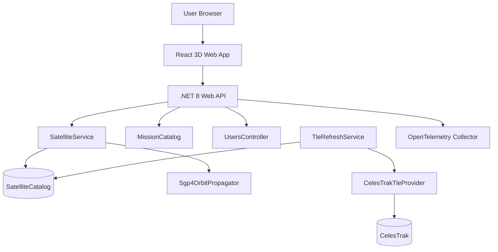

# AstroTrack — Architecture

A plain-English tour of how AstroTrack turns public satellite data into a live 3D
map you can explore. It's written for **students** and anyone new to the
codebase — no prior aerospace or distributed-systems background needed.

## The big picture

In one sentence: **a background worker downloads satellite data, the API serves
it, and the browser draws it on a 3D globe and works out when each satellite will
fly over you.**

## The pieces, and what each one actually does

| Part | Plain-English job |
|------|-------------------|
| **React 3D web app** | What you see — the spinning Earth, the satellite dots, the side panels. Runs in your browser. |
| **.NET 8 Web API** | The server. Hands the browser lists of satellites, their positions, and pass times. |
| **SatelliteService** | The *librarian*. Looks satellites up and answers questions about them. |
| **Sgp4OrbitPropagator** | The *calculator*. Takes a satellite's orbit data and works out where it is right now. |
| **TleRefreshService** | The *delivery worker*. Wakes up on a schedule and downloads fresh orbit data. |
| **CelesTrakTleProvider** | The *download adapter*. Knows how to talk to CelesTrak, the public data source. |
| **SatelliteCatalog** | The *filing cabinet*. Holds the satellites — either in memory, or in a PostgreSQL database. |

## The one idea you need first: a TLE

Every satellite's orbit is published as a tiny text record called a **Two-Line
Element set (TLE)** — literally two lines of numbers describing the shape and
tilt of the orbit and where the satellite was at a known moment.

A standard math model called **SGP4** takes a TLE plus a timestamp and returns a
position (latitude, longitude, altitude) and speed. That's the heart of every
satellite tracker, including this one. You don't need a live feed from each
satellite — the TLE plus SGP4 lets you compute the position yourself, for any
time, in the browser or on the server.

Student and university satellites (CubeSats) publish TLEs the same way the ISS
does, so you can look up your own mission by name and follow it on the globe.

## How the code is organised (clean architecture)

The backend is split into four layers. Each one only knows about the layer
"below" it, which keeps the important math independent of the web framework and
the database.

| Layer            | Project                       | What lives here |
|------------------|-------------------------------|------------------|
| **API**          | `AstroTrack.Api`              | The web server: HTTP endpoints, CORS, OpenTelemetry, controllers. |
| **Application**  | `AstroTrack.Application`      | The orchestration: services and the *interfaces* that describe what data sources must provide. |
| **Domain**       | `AstroTrack.Domain`           | The plain objects (like a `Satellite`) with no database or network code at all. |
| **Infrastructure** | `AstroTrack.Infrastructure` | The real implementations: the TLE downloader, the SGP4 calculator, the database, the background worker. |

The trick is that Application only depends on **interfaces**
(`ISatelliteCatalog`, `ITleProvider`, `IOrbitPropagator`, `IMissionCatalog`).
Infrastructure provides the concrete versions. So switching from the in-memory
catalog to PostgreSQL, or from CelesTrak to another data source, is a one-line
change in how the app is wired up — no controller or UI code changes.

## Following one satellite from data to dot

1. **Download.** On startup (and every 6 hours after), `TleRefreshService` asks
   `CelesTrakTleProvider` for the latest TLEs, parses them, and stores them in
   the catalog.
2. **List.** The browser calls `GET /api/satellites` and caches the result.
3. **Draw.** The 3D globe (`Globe.tsx`) runs SGP4 in the browser for every
   visible satellite, every animation frame, to place its dot.
4. **Inspect.** Click a dot → the detail panel shows live position, mission info,
   and upcoming passes.
5. **Predict.** Pass prediction sweeps forward in time to find when the satellite
   rises above your horizon, then exports the result as a calendar `.ics` file.

## Why the math runs in two places

SGP4 runs **both in the browser and on the server** — on purpose.

- **Browser:** keeps the animation smooth (60 fps) without asking the server for
  a new position every frame. It also means the frontend can run on its own,
  fetching TLEs straight from CelesTrak — handy for a classroom or lab with no
  backend at all.
- **Server:** gives authoritative answers for position and pass-prediction
  queries. Turn it on once you want a saved database, user accounts, or
  notifications.

Both sides follow the same SGP4 contract, so they agree on where things are.

## Working offline

The frontend ships with a small built-in set of TLEs and a static mission list,
and the API can run from an in-memory catalog with no database. So a student demo
keeps working even when the WiFi drops — the globe never goes dark.

## Observability (optional)

AstroTrack always creates OpenTelemetry traces and metrics inside the process,
but **nothing leaves the app unless you opt in**. Set
`OTEL_EXPORTER_OTLP_ENDPOINT` to point at any OpenTelemetry Collector to export
them; leave it unset and there's zero external dependency. A ready-made collector
is included for local use via the `observability` Docker profile. See
[configuration.md](configuration.md) for the full list of variables.

## Rough targets (if you self-host)

- `/api/satellites` responds in well under 200 ms once cached.
- TLE refresh succeeds the large majority of the time over a day.
- The globe stays smooth (~60 fps) with several hundred satellites on screen.
